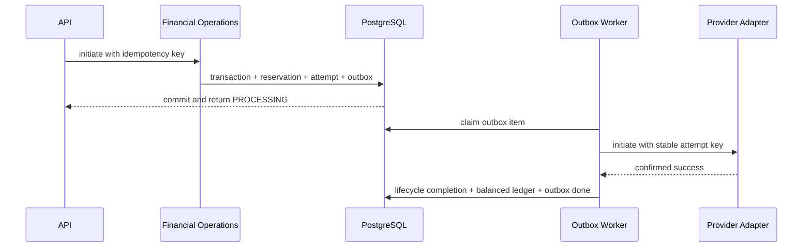

# Money Movement Hub (Blocks 3 and 4)

## Architecture and ownership

Financial operations continue to own validation, idempotency at the logical
transaction boundary, and the call into the lifecycle. The lifecycle reserves
debit funds and posts ledger entries. `MoneyMovementHub` owns provider routing,
durable attempts, webhook facts, status inquiry, and reconciliation. Provider
adapters translate the neutral request contract to a network protocol. Rules
remain in the existing rules boundary; this block adds no spending rules.



The commit of transaction state, reservation, provider attempt, and outbox row
uses one SQLAlchemy database transaction. The worker processes committed outbox
rows separately. There is no broker dependency.

## Provider boundary, capabilities, and routing

`ProviderInterface` accepts a `ProviderMovementRequest`, returns a
`ProviderResult`, supports optional status inquiry, and verifies/normalizes
webhooks. Adapters declare operation and capability support. The router selects
by operation, rail, and currency and fails explicitly when unsupported. Rails
are network identifiers; adapters are provider implementations. Credentials
belong in deployment configuration or a secret manager, never provider business
rows. Block 4 adds `RailResolver`, which normalizes Ghana phone destinations
into `+233...` form and requires an explicit rail. It does not infer the current
operator from prefixes because number portability makes that unreliable.
`ProviderRegistration` declares rails, operations, capabilities, enabled state,
environment, timeout, and retry configuration. Routing honors the exact rail
and fails closed without a configured adapter. The operations API uses the
configured router and no longer injects a sandbox provider directly. No live
provider adapter or production credentials are present.

## Attempts and idempotency

Each `ProviderAttempt` records the selected provider code, rail, operation,
amount, stable provider idempotency key, external reference, timestamps, and
request/result evidence. Its key derives from the Arezak transaction and
attempt number. Outbox processing reuses that attempt key. A new provider
attempt must not be created while an earlier result is ambiguous. The existing
transaction reference remains the caller's logical idempotency key; reuse with
different operation, amount, destination, or selected rail is rejected. New
external transactions persist their provider-independent rail.

## IN_DOUBT and recovery

`IN_DOUBT` means a request may have executed but Arezak lacks a definitive
result. It is not a failed transaction. A debit reservation remains protected,
and no completion ledger entry is posted. Recovery uses provider status inquiry,
a verified webhook, or reconciliation. Only confirmed success or failure may
resolve the transaction and release/consume the reservation.

```mermaid
sequenceDiagram
    participant Worker
    participant Provider
    participant DB as PostgreSQL
    participant Recovery as Status/Reconciliation
    Worker->>Provider: initiate (stable idempotency key)
    Provider--xWorker: timeout / response lost
    Worker->>DB: mark attempt and transaction IN_DOUBT
    Note over DB: reservation stays protected; no final ledger posting
    Recovery->>Provider: status inquiry using provider reference
    Provider-->>Recovery: confirmed COMPLETED or FAILED
    Recovery->>DB: resolve via transaction lifecycle
    Note over DB: exactly one legal transition and ledger effect
```

If a worker dies after marking an outbox item PROCESSING, operators should
investigate the attempt and provider reference before resending. Never route an
ambiguous operation through another provider.

## Webhooks

`POST /api/v1/webhooks/{provider_code}` delegates signature verification and
normalization to the adapter. A durable unique `(provider_code,
provider_event_id)` key makes repeat delivery harmless. The raw payload and its
SHA-256 digest are retained with processing status. Amount and currency are
checked against the attempt before a financial transition. Events do not mutate
balances directly; legal lifecycle transitions create ledger effects. Delayed,
duplicate, unknown-reference, and stale terminal-state events cannot move a
transaction backwards. Block 4 requires a timezone-aware verified event time
inside a bounded replay window and rejects reuse of an event ID with different
payload bytes.

The included sandbox signature uses a test-only fixed secret and is not suitable
for deployment. Real adapters must verify signatures against securely managed
provider credentials. Sandbox is registered only when
`MONEY_MOVEMENT_MODE=sandbox` in development/test (the development/test default).
Production has no implicit sandbox
fallback and external operations fail closed until a real adapter is configured.

The forward migration reconstructs minimal provider-attempt rows for legacy
external transactions from fields still present on `transactions`. The previous
Block 3 revision had already been applied in the configured database and retired
the old request table, so raw legacy request/response payloads cannot be
recovered by this migration.

## Reconciliation

`reconcile_transaction` compares Arezak status, attempt status/reference/amount,
provider observations supplied by the caller, and ledger balance. It returns a
`MATCH` or `DISCREPANCY` result and persists the evidence in
`reconciliation_records`. It reports mismatches; it does not silently repair
them. Block 4 adds `reconcile_due_transactions`, which queries the original
provider attempt for IN_DOUBT and overdue PROCESSING operations, validates
reference, amount, and currency, and resolves only verified final states through
the lifecycle. It is callable by a worker or operator; deployment scheduling
remains external.

Where supported, status inquiry can also use the original provider idempotency
key when a timeout occurred before Arezak received a provider reference. The
discovered reference is attached to that same attempt.

## Funding and outbound flows

Funding credits available balance only after provider confirmation and a
balanced ledger posting. SEND, PAY, and WITHDRAW reserve principal plus the
existing fee amount before dispatch. Confirmed success consumes the reservation;
confirmed failure releases it. Existing Arezak fee child transactions remain
separate from principal. Provider fees and real settlement are outside this
block.

## Failure recovery and security

Provider responses, callback bodies, references, status, amount, and currency
are untrusted until adapter verification and attempt matching. Logs and API
responses must never contain provider secrets. Webhook authentication failure
is rejected. Unresolved but authenticated evidence is retained for follow-up.
The outbox is polled from PostgreSQL; production deployment must run a worker
process and monitor old PROCESSING rows, IN_DOUBT transactions, and discrepancy
records.

## Adding a provider later

1. Add an adapter implementing the provider contract without importing it into
   financial operations or lifecycle code.
2. Declare supported rails, operations, and capabilities accurately.
3. Implement idempotent initiation, status inquiry where available, and
   signature-verified webhook normalization where available.
4. Store credentials in deployment secret configuration.
5. Register the adapter in the internal router and test success, failure,
   timeout, duplicate delivery, and reconciliation against the sandbox.
6. Keep network-specific recipient resolution in a rail resolver, outside the
   ledger and rules engine.

## Current limits

The sandbox is the only included adapter. A persistent worker deployment,
provider-management UI, automatic reconciliation scheduler, and production
credentials are not part of this block. No real provider integrations are
included. See [provider-integration.md](provider-integration.md) for Block 4
registry, rail, replay, and adapter setup details.
